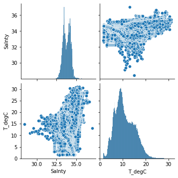
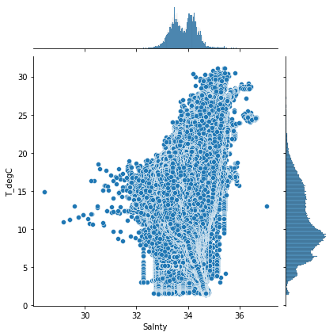
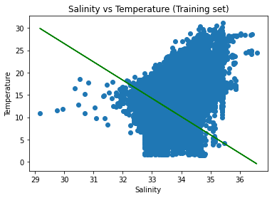
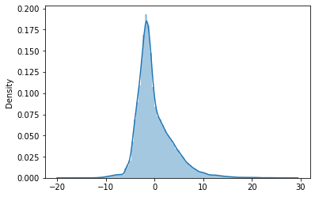

Is there a relationship between water salinity & water temperature? Can you predict the water temperature based on salinity?


```python
import pandas as pd
import numpy as np
import matplotlib.pyplot as plt
import seaborn as sns
```

    In /home/dongjun819/.local/lib/python3.6/site-packages/matplotlib/mpl-data/stylelib/_classic_test.mplstyle: 
    The text.latex.preview rcparam was deprecated in Matplotlib 3.3 and will be removed two minor releases later.
    In /home/dongjun819/.local/lib/python3.6/site-packages/matplotlib/mpl-data/stylelib/_classic_test.mplstyle: 
    The mathtext.fallback_to_cm rcparam was deprecated in Matplotlib 3.3 and will be removed two minor releases later.
    In /home/dongjun819/.local/lib/python3.6/site-packages/matplotlib/mpl-data/stylelib/_classic_test.mplstyle: Support for setting the 'mathtext.fallback_to_cm' rcParam is deprecated since 3.3 and will be removed two minor releases later; use 'mathtext.fallback : 'cm' instead.
    In /home/dongjun819/.local/lib/python3.6/site-packages/matplotlib/mpl-data/stylelib/_classic_test.mplstyle: 
    The validate_bool_maybe_none function was deprecated in Matplotlib 3.3 and will be removed two minor releases later.
    In /home/dongjun819/.local/lib/python3.6/site-packages/matplotlib/mpl-data/stylelib/_classic_test.mplstyle: 
    The savefig.jpeg_quality rcparam was deprecated in Matplotlib 3.3 and will be removed two minor releases later.
    In /home/dongjun819/.local/lib/python3.6/site-packages/matplotlib/mpl-data/stylelib/_classic_test.mplstyle: 
    The keymap.all_axes rcparam was deprecated in Matplotlib 3.3 and will be removed two minor releases later.
    In /home/dongjun819/.local/lib/python3.6/site-packages/matplotlib/mpl-data/stylelib/_classic_test.mplstyle: 
    The animation.avconv_path rcparam was deprecated in Matplotlib 3.3 and will be removed two minor releases later.
    In /home/dongjun819/.local/lib/python3.6/site-packages/matplotlib/mpl-data/stylelib/_classic_test.mplstyle: 
    The animation.avconv_args rcparam was deprecated in Matplotlib 3.3 and will be removed two minor releases later.


```python
bottle_data=pd.read_csv('bottle.csv')
bottle_data
```

    /home/dongjun819/.local/lib/python3.6/site-packages/IPython/core/interactiveshell.py:3072: DtypeWarning: Columns (47,73) have mixed types.Specify dtype option on import or set low_memory=False.
      interactivity=interactivity, compiler=compiler, result=result)


<div>
<style scoped>
    .dataframe tbody tr th:only-of-type {
        vertical-align: middle;
    }

    .dataframe tbody tr th {
        vertical-align: top;
    }

    .dataframe thead th {
        text-align: right;
    }
</style>
<table border="1" class="dataframe">
  <thead>
    <tr style="text-align: right;">
      <th></th>
      <th>Cst_Cnt</th>
      <th>Btl_Cnt</th>
      <th>Sta_ID</th>
      <th>Depth_ID</th>
      <th>Depthm</th>
      <th>T_degC</th>
      <th>Salnty</th>
      <th>O2ml_L</th>
      <th>STheta</th>
      <th>O2Sat</th>
      <th>...</th>
      <th>R_PHAEO</th>
      <th>R_PRES</th>
      <th>R_SAMP</th>
      <th>DIC1</th>
      <th>DIC2</th>
      <th>TA1</th>
      <th>TA2</th>
      <th>pH2</th>
      <th>pH1</th>
      <th>DIC Quality Comment</th>
    </tr>
  </thead>
  <tbody>
    <tr>
      <th>0</th>
      <td>1</td>
      <td>1</td>
      <td>054.0 056.0</td>
      <td>19-4903CR-HY-060-0930-05400560-0000A-3</td>
      <td>0</td>
      <td>10.500</td>
      <td>33.4400</td>
      <td>NaN</td>
      <td>25.64900</td>
      <td>NaN</td>
      <td>...</td>
      <td>NaN</td>
      <td>0</td>
      <td>NaN</td>
      <td>NaN</td>
      <td>NaN</td>
      <td>NaN</td>
      <td>NaN</td>
      <td>NaN</td>
      <td>NaN</td>
      <td>NaN</td>
    </tr>
    <tr>
      <th>1</th>
      <td>1</td>
      <td>2</td>
      <td>054.0 056.0</td>
      <td>19-4903CR-HY-060-0930-05400560-0008A-3</td>
      <td>8</td>
      <td>10.460</td>
      <td>33.4400</td>
      <td>NaN</td>
      <td>25.65600</td>
      <td>NaN</td>
      <td>...</td>
      <td>NaN</td>
      <td>8</td>
      <td>NaN</td>
      <td>NaN</td>
      <td>NaN</td>
      <td>NaN</td>
      <td>NaN</td>
      <td>NaN</td>
      <td>NaN</td>
      <td>NaN</td>
    </tr>
    <tr>
      <th>2</th>
      <td>1</td>
      <td>3</td>
      <td>054.0 056.0</td>
      <td>19-4903CR-HY-060-0930-05400560-0010A-7</td>
      <td>10</td>
      <td>10.460</td>
      <td>33.4370</td>
      <td>NaN</td>
      <td>25.65400</td>
      <td>NaN</td>
      <td>...</td>
      <td>NaN</td>
      <td>10</td>
      <td>NaN</td>
      <td>NaN</td>
      <td>NaN</td>
      <td>NaN</td>
      <td>NaN</td>
      <td>NaN</td>
      <td>NaN</td>
      <td>NaN</td>
    </tr>
    <tr>
      <th>3</th>
      <td>1</td>
      <td>4</td>
      <td>054.0 056.0</td>
      <td>19-4903CR-HY-060-0930-05400560-0019A-3</td>
      <td>19</td>
      <td>10.450</td>
      <td>33.4200</td>
      <td>NaN</td>
      <td>25.64300</td>
      <td>NaN</td>
      <td>...</td>
      <td>NaN</td>
      <td>19</td>
      <td>NaN</td>
      <td>NaN</td>
      <td>NaN</td>
      <td>NaN</td>
      <td>NaN</td>
      <td>NaN</td>
      <td>NaN</td>
      <td>NaN</td>
    </tr>
    <tr>
      <th>4</th>
      <td>1</td>
      <td>5</td>
      <td>054.0 056.0</td>
      <td>19-4903CR-HY-060-0930-05400560-0020A-7</td>
      <td>20</td>
      <td>10.450</td>
      <td>33.4210</td>
      <td>NaN</td>
      <td>25.64300</td>
      <td>NaN</td>
      <td>...</td>
      <td>NaN</td>
      <td>20</td>
      <td>NaN</td>
      <td>NaN</td>
      <td>NaN</td>
      <td>NaN</td>
      <td>NaN</td>
      <td>NaN</td>
      <td>NaN</td>
      <td>NaN</td>
    </tr>
    <tr>
      <th>...</th>
      <td>...</td>
      <td>...</td>
      <td>...</td>
      <td>...</td>
      <td>...</td>
      <td>...</td>
      <td>...</td>
      <td>...</td>
      <td>...</td>
      <td>...</td>
      <td>...</td>
      <td>...</td>
      <td>...</td>
      <td>...</td>
      <td>...</td>
      <td>...</td>
      <td>...</td>
      <td>...</td>
      <td>...</td>
      <td>...</td>
      <td>...</td>
    </tr>
    <tr>
      <th>864858</th>
      <td>34404</td>
      <td>864859</td>
      <td>093.4 026.4</td>
      <td>20-1611SR-MX-310-2239-09340264-0000A-7</td>
      <td>0</td>
      <td>18.744</td>
      <td>33.4083</td>
      <td>5.805</td>
      <td>23.87055</td>
      <td>108.74</td>
      <td>...</td>
      <td>0.18</td>
      <td>0</td>
      <td>NaN</td>
      <td>NaN</td>
      <td>NaN</td>
      <td>NaN</td>
      <td>NaN</td>
      <td>NaN</td>
      <td>NaN</td>
      <td>NaN</td>
    </tr>
    <tr>
      <th>864859</th>
      <td>34404</td>
      <td>864860</td>
      <td>093.4 026.4</td>
      <td>20-1611SR-MX-310-2239-09340264-0002A-3</td>
      <td>2</td>
      <td>18.744</td>
      <td>33.4083</td>
      <td>5.805</td>
      <td>23.87072</td>
      <td>108.74</td>
      <td>...</td>
      <td>0.18</td>
      <td>2</td>
      <td>4.0</td>
      <td>NaN</td>
      <td>NaN</td>
      <td>NaN</td>
      <td>NaN</td>
      <td>NaN</td>
      <td>NaN</td>
      <td>NaN</td>
    </tr>
    <tr>
      <th>864860</th>
      <td>34404</td>
      <td>864861</td>
      <td>093.4 026.4</td>
      <td>20-1611SR-MX-310-2239-09340264-0005A-3</td>
      <td>5</td>
      <td>18.692</td>
      <td>33.4150</td>
      <td>5.796</td>
      <td>23.88911</td>
      <td>108.46</td>
      <td>...</td>
      <td>0.18</td>
      <td>5</td>
      <td>3.0</td>
      <td>NaN</td>
      <td>NaN</td>
      <td>NaN</td>
      <td>NaN</td>
      <td>NaN</td>
      <td>NaN</td>
      <td>NaN</td>
    </tr>
    <tr>
      <th>864861</th>
      <td>34404</td>
      <td>864862</td>
      <td>093.4 026.4</td>
      <td>20-1611SR-MX-310-2239-09340264-0010A-3</td>
      <td>10</td>
      <td>18.161</td>
      <td>33.4062</td>
      <td>5.816</td>
      <td>24.01426</td>
      <td>107.74</td>
      <td>...</td>
      <td>0.31</td>
      <td>10</td>
      <td>2.0</td>
      <td>NaN</td>
      <td>NaN</td>
      <td>NaN</td>
      <td>NaN</td>
      <td>NaN</td>
      <td>NaN</td>
      <td>NaN</td>
    </tr>
    <tr>
      <th>864862</th>
      <td>34404</td>
      <td>864863</td>
      <td>093.4 026.4</td>
      <td>20-1611SR-MX-310-2239-09340264-0015A-3</td>
      <td>15</td>
      <td>17.533</td>
      <td>33.3880</td>
      <td>5.774</td>
      <td>24.15297</td>
      <td>105.66</td>
      <td>...</td>
      <td>0.61</td>
      <td>15</td>
      <td>1.0</td>
      <td>NaN</td>
      <td>NaN</td>
      <td>NaN</td>
      <td>NaN</td>
      <td>NaN</td>
      <td>NaN</td>
      <td>NaN</td>
    </tr>
  </tbody>
</table>
<p>864863 rows × 74 columns</p>
</div>


```python
bottle_data.shape
```


    (864863, 74)


```python
bottle_data.describe()
```


<div>
<style scoped>
    .dataframe tbody tr th:only-of-type {
        vertical-align: middle;
    }

    .dataframe tbody tr th {
        vertical-align: top;
    }

    .dataframe thead th {
        text-align: right;
    }
</style>
<table border="1" class="dataframe">
  <thead>
    <tr style="text-align: right;">
      <th></th>
      <th>Cst_Cnt</th>
      <th>Btl_Cnt</th>
      <th>Depthm</th>
      <th>T_degC</th>
      <th>Salnty</th>
      <th>O2ml_L</th>
      <th>STheta</th>
      <th>O2Sat</th>
      <th>Oxy_µmol/Kg</th>
      <th>BtlNum</th>
      <th>...</th>
      <th>R_CHLA</th>
      <th>R_PHAEO</th>
      <th>R_PRES</th>
      <th>R_SAMP</th>
      <th>DIC1</th>
      <th>DIC2</th>
      <th>TA1</th>
      <th>TA2</th>
      <th>pH2</th>
      <th>pH1</th>
    </tr>
  </thead>
  <tbody>
    <tr>
      <th>count</th>
      <td>864863.000000</td>
      <td>864863.000000</td>
      <td>864863.000000</td>
      <td>853900.000000</td>
      <td>817509.000000</td>
      <td>696201.000000</td>
      <td>812174.000000</td>
      <td>661274.000000</td>
      <td>661268.000000</td>
      <td>118667.000000</td>
      <td>...</td>
      <td>225276.000000</td>
      <td>225275.000000</td>
      <td>864863.000000</td>
      <td>122006.000000</td>
      <td>1999.000000</td>
      <td>224.000000</td>
      <td>2084.000000</td>
      <td>234.000000</td>
      <td>10.000000</td>
      <td>84.000000</td>
    </tr>
    <tr>
      <th>mean</th>
      <td>17138.790958</td>
      <td>432432.000000</td>
      <td>226.831951</td>
      <td>10.799677</td>
      <td>33.840350</td>
      <td>3.392468</td>
      <td>25.819394</td>
      <td>57.103779</td>
      <td>148.808694</td>
      <td>10.497426</td>
      <td>...</td>
      <td>0.450225</td>
      <td>0.198599</td>
      <td>228.395694</td>
      <td>162.071521</td>
      <td>2153.239714</td>
      <td>2168.148330</td>
      <td>2256.055845</td>
      <td>2278.858803</td>
      <td>7.948570</td>
      <td>7.910983</td>
    </tr>
    <tr>
      <th>std</th>
      <td>10240.949817</td>
      <td>249664.587269</td>
      <td>316.050259</td>
      <td>4.243825</td>
      <td>0.461843</td>
      <td>2.073256</td>
      <td>1.167787</td>
      <td>37.094137</td>
      <td>90.187533</td>
      <td>6.189688</td>
      <td>...</td>
      <td>1.208566</td>
      <td>0.376539</td>
      <td>319.456731</td>
      <td>85.722796</td>
      <td>112.995202</td>
      <td>154.852332</td>
      <td>34.844435</td>
      <td>58.496495</td>
      <td>0.021216</td>
      <td>0.077666</td>
    </tr>
    <tr>
      <th>min</th>
      <td>1.000000</td>
      <td>1.000000</td>
      <td>0.000000</td>
      <td>1.440000</td>
      <td>28.431000</td>
      <td>-0.010000</td>
      <td>20.934000</td>
      <td>-0.100000</td>
      <td>-0.434900</td>
      <td>0.000000</td>
      <td>...</td>
      <td>-0.010000</td>
      <td>-3.890000</td>
      <td>0.000000</td>
      <td>0.000000</td>
      <td>1948.850000</td>
      <td>1969.440000</td>
      <td>2181.570000</td>
      <td>2198.150000</td>
      <td>7.923100</td>
      <td>7.618300</td>
    </tr>
    <tr>
      <th>25%</th>
      <td>8269.000000</td>
      <td>216216.500000</td>
      <td>46.000000</td>
      <td>7.680000</td>
      <td>33.488000</td>
      <td>1.360000</td>
      <td>24.965000</td>
      <td>21.100000</td>
      <td>60.915470</td>
      <td>5.000000</td>
      <td>...</td>
      <td>0.050000</td>
      <td>0.050000</td>
      <td>46.000000</td>
      <td>200.000000</td>
      <td>2028.330000</td>
      <td>2008.977500</td>
      <td>2230.322500</td>
      <td>2229.062500</td>
      <td>7.931475</td>
      <td>7.898675</td>
    </tr>
    <tr>
      <th>50%</th>
      <td>16848.000000</td>
      <td>432432.000000</td>
      <td>125.000000</td>
      <td>10.060000</td>
      <td>33.863000</td>
      <td>3.440000</td>
      <td>25.996000</td>
      <td>54.400000</td>
      <td>151.064150</td>
      <td>10.000000</td>
      <td>...</td>
      <td>0.160000</td>
      <td>0.110000</td>
      <td>126.000000</td>
      <td>206.000000</td>
      <td>2170.640000</td>
      <td>2265.885000</td>
      <td>2244.325000</td>
      <td>2247.505000</td>
      <td>7.946650</td>
      <td>7.928850</td>
    </tr>
    <tr>
      <th>75%</th>
      <td>26557.000000</td>
      <td>648647.500000</td>
      <td>300.000000</td>
      <td>13.880000</td>
      <td>34.196900</td>
      <td>5.500000</td>
      <td>26.646000</td>
      <td>97.600000</td>
      <td>240.379600</td>
      <td>16.000000</td>
      <td>...</td>
      <td>0.390000</td>
      <td>0.230000</td>
      <td>302.000000</td>
      <td>214.000000</td>
      <td>2253.810000</td>
      <td>2315.525000</td>
      <td>2278.505000</td>
      <td>2316.452500</td>
      <td>7.963300</td>
      <td>7.955100</td>
    </tr>
    <tr>
      <th>max</th>
      <td>34404.000000</td>
      <td>864863.000000</td>
      <td>5351.000000</td>
      <td>31.140000</td>
      <td>37.034000</td>
      <td>11.130000</td>
      <td>250.784000</td>
      <td>214.100000</td>
      <td>485.701800</td>
      <td>25.000000</td>
      <td>...</td>
      <td>66.110000</td>
      <td>65.300000</td>
      <td>5458.000000</td>
      <td>424.000000</td>
      <td>2367.800000</td>
      <td>2364.420000</td>
      <td>2434.900000</td>
      <td>2437.000000</td>
      <td>7.988300</td>
      <td>8.047700</td>
    </tr>
  </tbody>
</table>
<p>8 rows × 70 columns</p>
</div>


```python
bottle_data.columns
```


    Index(['Cst_Cnt', 'Btl_Cnt', 'Sta_ID', 'Depth_ID', 'Depthm', 'T_degC',
           'Salnty', 'O2ml_L', 'STheta', 'O2Sat', 'Oxy_µmol/Kg', 'BtlNum',
           'RecInd', 'T_prec', 'T_qual', 'S_prec', 'S_qual', 'P_qual', 'O_qual',
           'SThtaq', 'O2Satq', 'ChlorA', 'Chlqua', 'Phaeop', 'Phaqua', 'PO4uM',
           'PO4q', 'SiO3uM', 'SiO3qu', 'NO2uM', 'NO2q', 'NO3uM', 'NO3q', 'NH3uM',
           'NH3q', 'C14As1', 'C14A1p', 'C14A1q', 'C14As2', 'C14A2p', 'C14A2q',
           'DarkAs', 'DarkAp', 'DarkAq', 'MeanAs', 'MeanAp', 'MeanAq', 'IncTim',
           'LightP', 'R_Depth', 'R_TEMP', 'R_POTEMP', 'R_SALINITY', 'R_SIGMA',
           'R_SVA', 'R_DYNHT', 'R_O2', 'R_O2Sat', 'R_SIO3', 'R_PO4', 'R_NO3',
           'R_NO2', 'R_NH4', 'R_CHLA', 'R_PHAEO', 'R_PRES', 'R_SAMP', 'DIC1',
           'DIC2', 'TA1', 'TA2', 'pH2', 'pH1', 'DIC Quality Comment'],
          dtype='object')


Take salnty and temperature from the data


```python
salinity_temp=bottle_data[['Salnty','T_degC']]
salinity_temp
```


<div>
<style scoped>
    .dataframe tbody tr th:only-of-type {
        vertical-align: middle;
    }

    .dataframe tbody tr th {
        vertical-align: top;
    }

    .dataframe thead th {
        text-align: right;
    }
</style>
<table border="1" class="dataframe">
  <thead>
    <tr style="text-align: right;">
      <th></th>
      <th>Salnty</th>
      <th>T_degC</th>
    </tr>
  </thead>
  <tbody>
    <tr>
      <th>0</th>
      <td>33.4400</td>
      <td>10.500</td>
    </tr>
    <tr>
      <th>1</th>
      <td>33.4400</td>
      <td>10.460</td>
    </tr>
    <tr>
      <th>2</th>
      <td>33.4370</td>
      <td>10.460</td>
    </tr>
    <tr>
      <th>3</th>
      <td>33.4200</td>
      <td>10.450</td>
    </tr>
    <tr>
      <th>4</th>
      <td>33.4210</td>
      <td>10.450</td>
    </tr>
    <tr>
      <th>...</th>
      <td>...</td>
      <td>...</td>
    </tr>
    <tr>
      <th>864858</th>
      <td>33.4083</td>
      <td>18.744</td>
    </tr>
    <tr>
      <th>864859</th>
      <td>33.4083</td>
      <td>18.744</td>
    </tr>
    <tr>
      <th>864860</th>
      <td>33.4150</td>
      <td>18.692</td>
    </tr>
    <tr>
      <th>864861</th>
      <td>33.4062</td>
      <td>18.161</td>
    </tr>
    <tr>
      <th>864862</th>
      <td>33.3880</td>
      <td>17.533</td>
    </tr>
  </tbody>
</table>
<p>864863 rows × 2 columns</p>
</div>


```python
salinity_temp.describe()
```


<div>
<style scoped>
    .dataframe tbody tr th:only-of-type {
        vertical-align: middle;
    }

    .dataframe tbody tr th {
        vertical-align: top;
    }

    .dataframe thead th {
        text-align: right;
    }
</style>
<table border="1" class="dataframe">
  <thead>
    <tr style="text-align: right;">
      <th></th>
      <th>Salnty</th>
      <th>T_degC</th>
    </tr>
  </thead>
  <tbody>
    <tr>
      <th>count</th>
      <td>817509.000000</td>
      <td>853900.000000</td>
    </tr>
    <tr>
      <th>mean</th>
      <td>33.840350</td>
      <td>10.799677</td>
    </tr>
    <tr>
      <th>std</th>
      <td>0.461843</td>
      <td>4.243825</td>
    </tr>
    <tr>
      <th>min</th>
      <td>28.431000</td>
      <td>1.440000</td>
    </tr>
    <tr>
      <th>25%</th>
      <td>33.488000</td>
      <td>7.680000</td>
    </tr>
    <tr>
      <th>50%</th>
      <td>33.863000</td>
      <td>10.060000</td>
    </tr>
    <tr>
      <th>75%</th>
      <td>34.196900</td>
      <td>13.880000</td>
    </tr>
    <tr>
      <th>max</th>
      <td>37.034000</td>
      <td>31.140000</td>
    </tr>
  </tbody>
</table>
</div>


Number of null value in table


```python
salinity_temp.isnull().sum()
```


    Salnty    47354
    T_degC    10963
    dtype: int64


Remove null value in table


```python
salinity_temp.fillna(method='ffill', inplace=True)
```

    /home/dongjun819/.local/lib/python3.6/site-packages/pandas/core/frame.py:4323: SettingWithCopyWarning: 
    A value is trying to be set on a copy of a slice from a DataFrame
    
    See the caveats in the documentation: https://pandas.pydata.org/pandas-docs/stable/user_guide/indexing.html#returning-a-view-versus-a-copy
      downcast=downcast,


```python
salinity_temp.isnull().sum()
```


    Salnty    0
    T_degC    0
    dtype: int64


```python
sns.pairplot(salinity_temp)
```


    <seaborn.axisgrid.PairGrid at 0x7f813f52ad30>


    

    


```python
sns.jointplot(data=salinity_temp, x='Salnty', y='T_degC')
```


    <seaborn.axisgrid.JointGrid at 0x7f813d636208>


    

    


```python
X=salinity_temp[['Salnty']]
Y=salinity_temp[['T_degC']]
```


```python
from sklearn.model_selection import train_test_split

X_train, X_test, Y_train, Y_test = train_test_split(X, Y, test_size=0.2, random_state=100)
```

Linear Regression to predict the water temperature based on salinity


```python
from sklearn.linear_model import LinearRegression
```


```python
model = LinearRegression(normalize=True)
model.fit(X_train,Y_train)
```


    LinearRegression(copy_X=True, fit_intercept=True, n_jobs=None, normalize=True)


```python
model.intercept_
```


    array([149.28489416])


```python
pred = model.predict(X_test)
print(pred)
```

    [[13.83694475]
     [12.0053779 ]
     [ 8.8415764 ]
     ...
     [12.32871596]
     [11.57971768]
     [10.91667001]]


```python
model.score(X_test,Y_test)
```


    0.20858523587474365


```python
plt.scatter(X_test, Y_test)
plt.plot(X_test, pred, color = 'g')
plt.title("Salinity vs Temperature (Training set)")
plt.xlabel("Salinity")
plt.ylabel("Temperature")
```


    Text(0, 0.5, 'Temperature')


    

    


```python
sns.distplot((Y_test-pred),bins=100);
```

    /home/dongjun819/.local/lib/python3.6/site-packages/seaborn/distributions.py:2551: FutureWarning: `distplot` is a deprecated function and will be removed in a future version. Please adapt your code to use either `displot` (a figure-level function with similar flexibility) or `histplot` (an axes-level function for histograms).
      warnings.warn(msg, FutureWarning)


    

    


```python
test_pred = model.predict(X_test)
train_pred = model.predict(X_train)
```


```python
from sklearn import metrics
from sklearn.model_selection import cross_val_score
```


```python
def print_evaluate(true, predicted):  
    mae = metrics.mean_absolute_error(true, predicted)
    mse = metrics.mean_squared_error(true, predicted)
    rmse = np.sqrt(metrics.mean_squared_error(true, predicted))
    r2_square = metrics.r2_score(true, predicted)
    print('MAE:', mae)
    print('MSE:', mse)
    print('RMSE:', rmse)
    print('R2 Square', r2_square)
```


```python
print_evaluate(Y_train,train_pred)
```

    MAE: 2.8169756034019864
    MSE: 14.478081863541446
    RMSE: 3.8050074722057308
    R2 Square 0.20316812122349415

