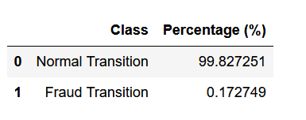
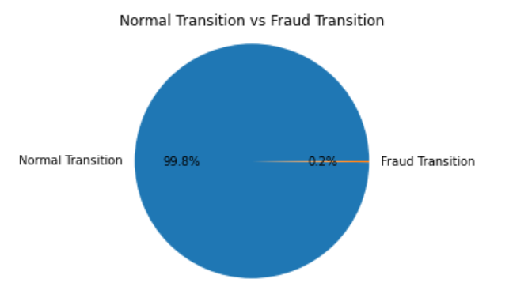
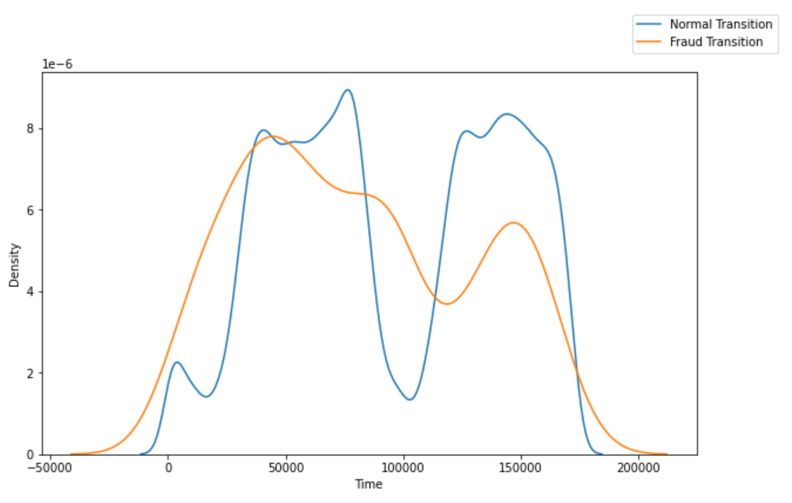

## Credit Card Fraud Detection
Anonymized credit card transactions labeled as fraudulent or genuine

Data Scource for this code is from <a href="https://www.kaggle.com/mlg-ulb/creditcardfraud"> kaggle 

## Normal Transition vs. Fraud Transition

## Normal Transition vs. Fraud Transition based on Time

