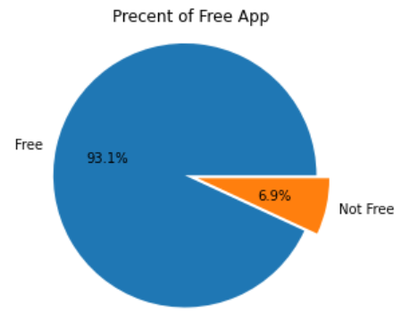
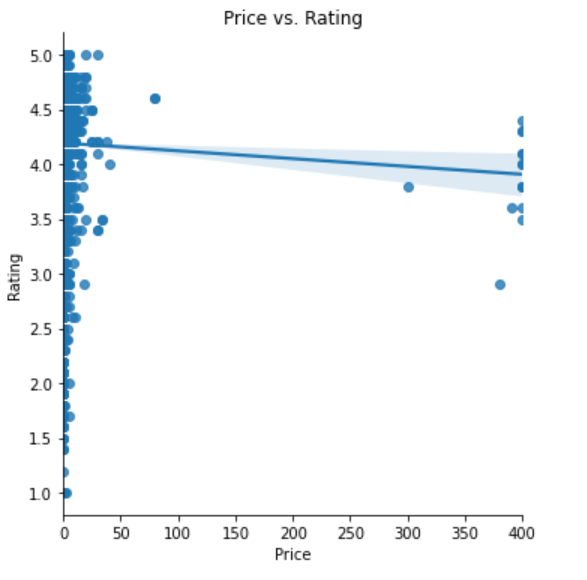
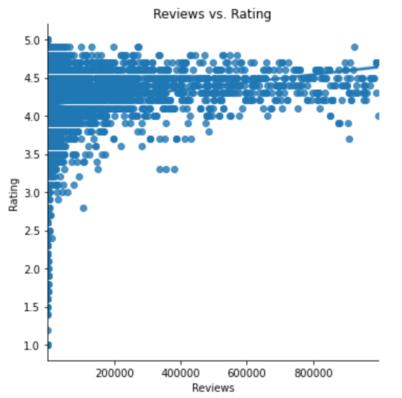
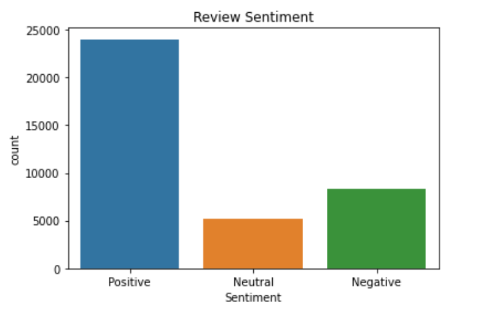
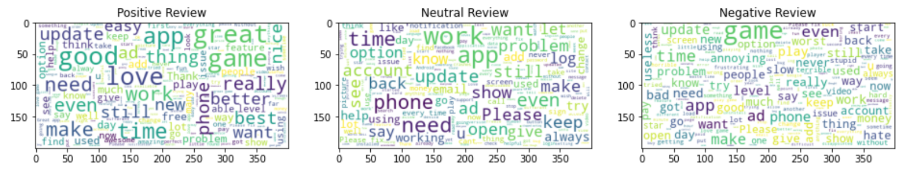
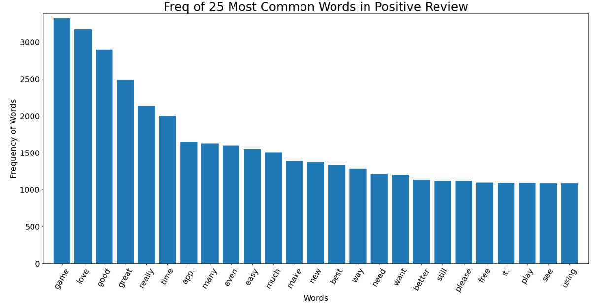
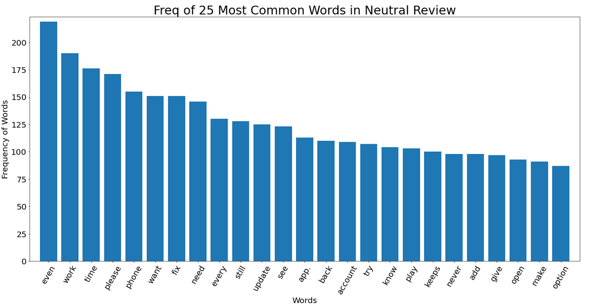
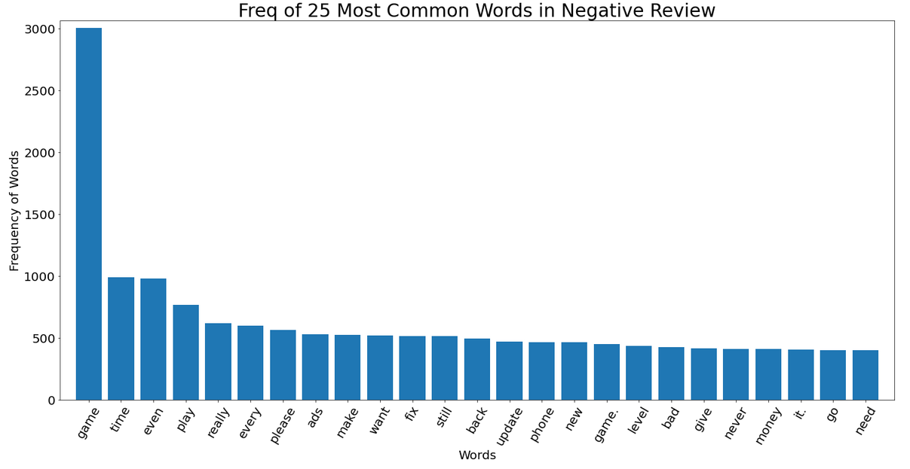

## Google Play Store Apps <a href="https://www.kaggle.com/dongjun819/google-play-store-analysis"> code

Web scraped data of 10k Play Store apps for analysing the Android market.

Data Scource for this code is from <a href="https://www.kaggle.com/lava18/google-play-store-apps"> kaggle 

### % of Free Application in Google Play Store

### Price vs. Rating
Rating decreases as the app price increase.

### Reviews vs. Rating

## Sentiment Review Analysis

### WordCloud

### Top 25 Positive Review Frequency
There are mostly positive words in positive review such as "love", "good", "great", etc.

### Top 25 Neutral Review Frequency

### Top 25 Negative Review Frequency

