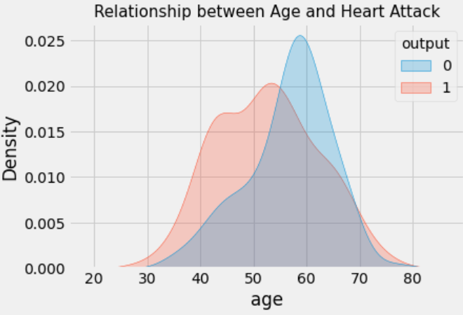
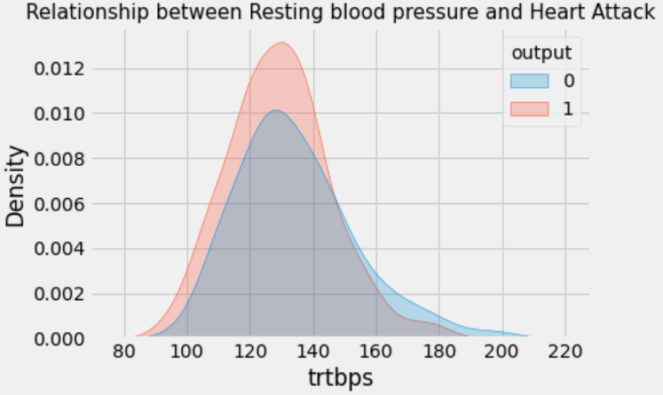
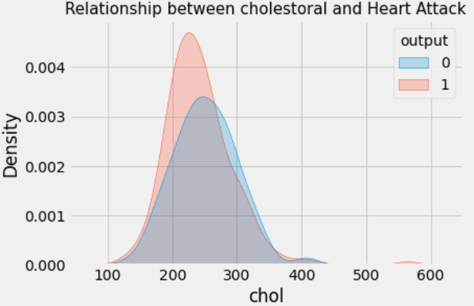
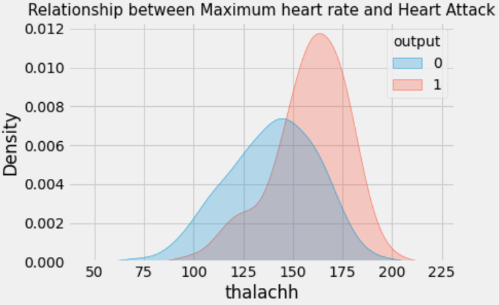

## <a href="https://www.kaggle.com/dongjun819/heart-attack-analysis"> Heart Attack Analysis & Prediction Dataset </a>
A dataset for heart attack classification

Data Scource for this code is from <a href="https://www.kaggle.com/rashikrahmanpritom/heart-attack-analysis-prediction-dataset"> kaggle </a>

### Label
- Blue Color
    - Normal
- Red Color
    - Heart Attack

### Relationship between Age and Heart Attack

### Relationship between Resting blood pressure and Heart Attack

### Relationship between cholestoral and Heart Attack

### Relationship between Maximum heart rate and Heart Attack

### Based on Analyzing Data
  - High Blood Pressure, High Cholestrol and Higher Heart Rate leads to high chance of heart attack.
  - Male have more percentage to have heart attack
  - Age from 40-60 years have the high chance of heart attack.
