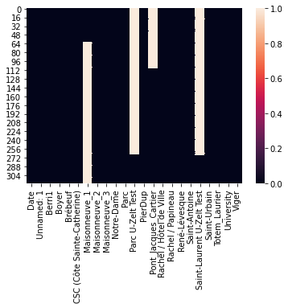
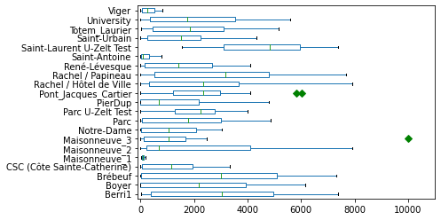
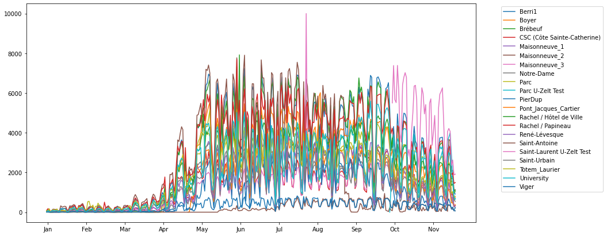
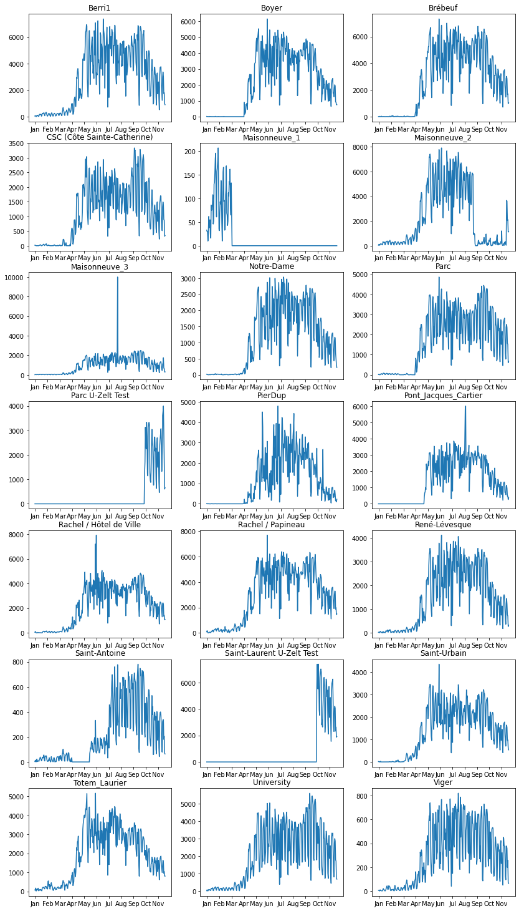
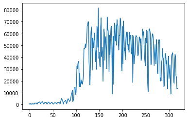
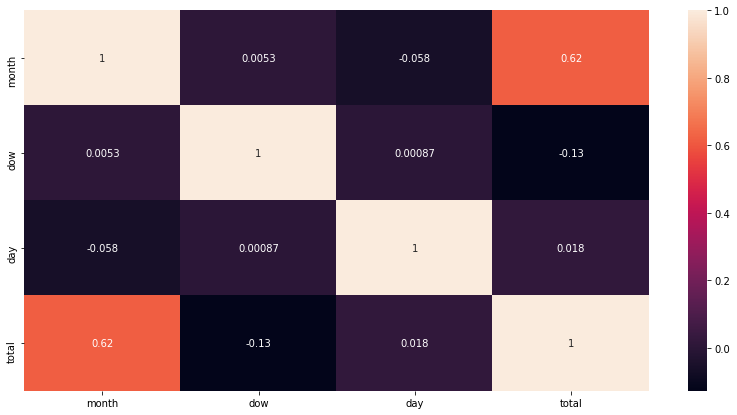
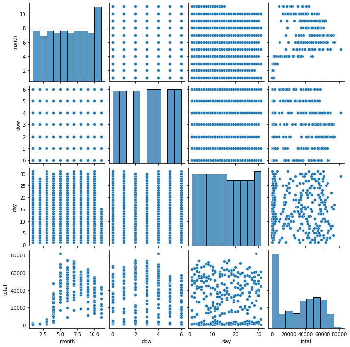
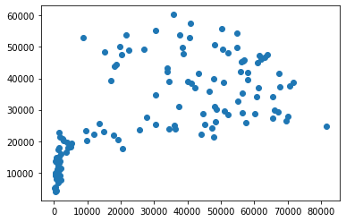
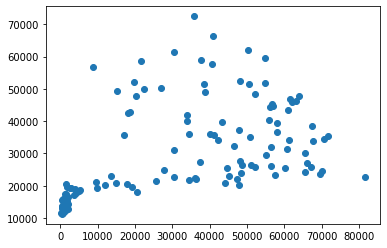

```python
import pandas as pd
import numpy as np
import matplotlib.pyplot as plt
import seaborn as sns
import matplotlib as mpl
from matplotlib import pyplot as plt
import datetime as datetime
import warnings
warnings.filterwarnings('ignore')
```

```python
data= pd.read_csv('comptagesvelo2015.csv')
data.head()
```


<div>
<style scoped>
    .dataframe tbody tr th:only-of-type {
        vertical-align: middle;
    }

    .dataframe tbody tr th {
        vertical-align: top;
    }

    .dataframe thead th {
        text-align: right;
    }
</style>
<table border="1" class="dataframe">
  <thead>
    <tr style="text-align: right;">
      <th></th>
      <th>Date</th>
      <th>Unnamed: 1</th>
      <th>Berri1</th>
      <th>Boyer</th>
      <th>Brébeuf</th>
      <th>CSC (Côte Sainte-Catherine)</th>
      <th>Maisonneuve_1</th>
      <th>Maisonneuve_2</th>
      <th>Maisonneuve_3</th>
      <th>Notre-Dame</th>
      <th>...</th>
      <th>Pont_Jacques_Cartier</th>
      <th>Rachel / Hôtel de Ville</th>
      <th>Rachel / Papineau</th>
      <th>René-Lévesque</th>
      <th>Saint-Antoine</th>
      <th>Saint-Laurent U-Zelt Test</th>
      <th>Saint-Urbain</th>
      <th>Totem_Laurier</th>
      <th>University</th>
      <th>Viger</th>
    </tr>
  </thead>
  <tbody>
    <tr>
      <th>0</th>
      <td>01/01/2015</td>
      <td>00:00</td>
      <td>58</td>
      <td>12</td>
      <td>4</td>
      <td>17</td>
      <td>33.0</td>
      <td>49</td>
      <td>21</td>
      <td>16</td>
      <td>...</td>
      <td>NaN</td>
      <td>58</td>
      <td>91</td>
      <td>24</td>
      <td>3</td>
      <td>NaN</td>
      <td>17</td>
      <td>78</td>
      <td>21</td>
      <td>6</td>
    </tr>
    <tr>
      <th>1</th>
      <td>02/01/2015</td>
      <td>00:00</td>
      <td>75</td>
      <td>7</td>
      <td>5</td>
      <td>15</td>
      <td>30.0</td>
      <td>113</td>
      <td>27</td>
      <td>9</td>
      <td>...</td>
      <td>NaN</td>
      <td>109</td>
      <td>177</td>
      <td>32</td>
      <td>13</td>
      <td>NaN</td>
      <td>11</td>
      <td>57</td>
      <td>77</td>
      <td>4</td>
    </tr>
    <tr>
      <th>2</th>
      <td>03/01/2015</td>
      <td>00:00</td>
      <td>79</td>
      <td>7</td>
      <td>3</td>
      <td>7</td>
      <td>30.0</td>
      <td>107</td>
      <td>36</td>
      <td>12</td>
      <td>...</td>
      <td>NaN</td>
      <td>71</td>
      <td>131</td>
      <td>33</td>
      <td>5</td>
      <td>NaN</td>
      <td>14</td>
      <td>174</td>
      <td>40</td>
      <td>5</td>
    </tr>
    <tr>
      <th>3</th>
      <td>04/01/2015</td>
      <td>00:00</td>
      <td>10</td>
      <td>1</td>
      <td>21</td>
      <td>0</td>
      <td>10.0</td>
      <td>35</td>
      <td>29</td>
      <td>1</td>
      <td>...</td>
      <td>NaN</td>
      <td>6</td>
      <td>11</td>
      <td>6</td>
      <td>1</td>
      <td>NaN</td>
      <td>1</td>
      <td>20</td>
      <td>6</td>
      <td>0</td>
    </tr>
    <tr>
      <th>4</th>
      <td>05/01/2015</td>
      <td>00:00</td>
      <td>42</td>
      <td>0</td>
      <td>2</td>
      <td>0</td>
      <td>27.0</td>
      <td>90</td>
      <td>21</td>
      <td>1</td>
      <td>...</td>
      <td>NaN</td>
      <td>0</td>
      <td>5</td>
      <td>49</td>
      <td>20</td>
      <td>NaN</td>
      <td>0</td>
      <td>41</td>
      <td>56</td>
      <td>10</td>
    </tr>
  </tbody>
</table>
<p>5 rows × 23 columns</p>
</div>


```python
data.columns
```


    Index(['Date', 'Unnamed: 1', 'Berri1', 'Boyer', 'Brébeuf',
           'CSC (Côte Sainte-Catherine)', 'Maisonneuve_1', 'Maisonneuve_2',
           'Maisonneuve_3', 'Notre-Dame', 'Parc', 'Parc U-Zelt Test', 'PierDup',
           'Pont_Jacques_Cartier', 'Rachel / Hôtel de Ville', 'Rachel / Papineau',
           'René-Lévesque', 'Saint-Antoine', 'Saint-Laurent U-Zelt Test',
           'Saint-Urbain', 'Totem_Laurier', 'University', 'Viger'],
          dtype='object')


```python
data.shape
```


    (319, 23)


```python
sns.heatmap(data.isnull())
```


    <AxesSubplot:>


    

    


```python
data.plot(kind='box', sym='gD', vert=False, xlim=(-100,11000))
```


    <AxesSubplot:>


    

    


```python
mon=["Jan","Feb","Mar","Apr","May","Jun","Jul","Aug","Sep","Oct","Nov"]
plt.figure(figsize=(14,7))
for i in range(2, len(data.columns)):
    plt.plot(data["Date"], data[data.columns[i]], label=data.columns[i])
plt.xticks(np.arange(1,319,30),mon)
plt.legend(loc=2,bbox_to_anchor=(1.05,1))
```


    <matplotlib.legend.Legend at 0x7f20aad5fcc0>


    

    


```python
street_cols=data.columns[2:23]
len(street_cols)
```


    21


```python
data[data["Maisonneuve_3"]==data["Maisonneuve_3"].max()]
```


<div>
<style scoped>
    .dataframe tbody tr th:only-of-type {
        vertical-align: middle;
    }

    .dataframe tbody tr th {
        vertical-align: top;
    }

    .dataframe thead th {
        text-align: right;
    }
</style>
<table border="1" class="dataframe">
  <thead>
    <tr style="text-align: right;">
      <th></th>
      <th>Date</th>
      <th>Unnamed: 1</th>
      <th>Berri1</th>
      <th>Boyer</th>
      <th>Brébeuf</th>
      <th>CSC (Côte Sainte-Catherine)</th>
      <th>Maisonneuve_1</th>
      <th>Maisonneuve_2</th>
      <th>Maisonneuve_3</th>
      <th>Notre-Dame</th>
      <th>...</th>
      <th>Pont_Jacques_Cartier</th>
      <th>Rachel / Hôtel de Ville</th>
      <th>Rachel / Papineau</th>
      <th>René-Lévesque</th>
      <th>Saint-Antoine</th>
      <th>Saint-Laurent U-Zelt Test</th>
      <th>Saint-Urbain</th>
      <th>Totem_Laurier</th>
      <th>University</th>
      <th>Viger</th>
    </tr>
  </thead>
  <tbody>
    <tr>
      <th>202</th>
      <td>22/07/2015</td>
      <td>00:00</td>
      <td>5396</td>
      <td>4174</td>
      <td>5628</td>
      <td>2296</td>
      <td>NaN</td>
      <td>6700</td>
      <td>9999</td>
      <td>2562</td>
      <td>...</td>
      <td>2990.0</td>
      <td>3849</td>
      <td>5288</td>
      <td>3301</td>
      <td>777</td>
      <td>NaN</td>
      <td>2575</td>
      <td>3928</td>
      <td>4088</td>
      <td>723</td>
    </tr>
  </tbody>
</table>
<p>1 rows × 23 columns</p>
</div>


```python
data.fillna(value=0,inplace=True)
```


```python
fig = plt.figure(figsize=(14, 26))
columns = 3
rows = 7
ax = []
for i in range(columns*rows):
    ax.append( fig.add_subplot(rows, columns, i+1) )
    ax[i].set_title(street_cols[i])
    plt.setp(ax,xticks=np.arange(1,319,30), xticklabels=mon)
for i in range(len(street_cols)):
    ax[i].plot(data["Date"],data[street_cols[i]],label=street_cols)
```


    

    


```python
def change_date_format(data):
    return datetime.datetime.strptime(data,"%d/%m/%Y")
```


```python
data["dates"]=data["Date"].apply(change_date_format)
```


```python
data["month"]=data["dates"].dt.month
data["day"]=data["dates"].dt.day
data["dow"]=data["dates"].dt.dayofweek
```


```python
val=[]
for i in range(len(data)):
    val.append(data.iloc[i,2:23].values.sum())
```


```python
data["total"]=val
```


```python
plt.plot(data['total'])
```


    [<matplotlib.lines.Line2D at 0x7f20a8f37e10>]


    

    


```python
data_date=data[["month","dow","day","total"]]
data_date
```


<div>
<style scoped>
    .dataframe tbody tr th:only-of-type {
        vertical-align: middle;
    }

    .dataframe tbody tr th {
        vertical-align: top;
    }

    .dataframe thead th {
        text-align: right;
    }
</style>
<table border="1" class="dataframe">
  <thead>
    <tr style="text-align: right;">
      <th></th>
      <th>month</th>
      <th>dow</th>
      <th>day</th>
      <th>total</th>
    </tr>
  </thead>
  <tbody>
    <tr>
      <th>0</th>
      <td>1</td>
      <td>3</td>
      <td>1</td>
      <td>531.0</td>
    </tr>
    <tr>
      <th>1</th>
      <td>1</td>
      <td>4</td>
      <td>2</td>
      <td>804.0</td>
    </tr>
    <tr>
      <th>2</th>
      <td>1</td>
      <td>5</td>
      <td>3</td>
      <td>774.0</td>
    </tr>
    <tr>
      <th>3</th>
      <td>1</td>
      <td>6</td>
      <td>4</td>
      <td>158.0</td>
    </tr>
    <tr>
      <th>4</th>
      <td>1</td>
      <td>0</td>
      <td>5</td>
      <td>371.0</td>
    </tr>
    <tr>
      <th>...</th>
      <td>...</td>
      <td>...</td>
      <td>...</td>
      <td>...</td>
    </tr>
    <tr>
      <th>314</th>
      <td>11</td>
      <td>2</td>
      <td>11</td>
      <td>40940.0</td>
    </tr>
    <tr>
      <th>315</th>
      <td>11</td>
      <td>3</td>
      <td>12</td>
      <td>24175.0</td>
    </tr>
    <tr>
      <th>316</th>
      <td>11</td>
      <td>4</td>
      <td>13</td>
      <td>23331.0</td>
    </tr>
    <tr>
      <th>317</th>
      <td>11</td>
      <td>5</td>
      <td>14</td>
      <td>13298.0</td>
    </tr>
    <tr>
      <th>318</th>
      <td>11</td>
      <td>6</td>
      <td>15</td>
      <td>13598.0</td>
    </tr>
  </tbody>
</table>
<p>319 rows × 4 columns</p>
</div>


```python
plt.figure(figsize=(14,7))
sns.heatmap(data_date.corr(),annot=True)
```


    <AxesSubplot:>


    

    


```python
sns.pairplot(data_date)
```


    <seaborn.axisgrid.PairGrid at 0x7f20a8f05668>


    

    


```python
data_date=data[["month","dow","day","total"]]
```


```python
X=data_date.drop("total",axis=1)
Y=data_date["total"]
```


```python
from sklearn.model_selection import train_test_split

X_train, X_test, Y_train, Y_test = train_test_split(X, Y, test_size=0.4)
```

## Linear Regression 


```python
from sklearn.linear_model import LinearRegression
```


```python
model = LinearRegression()
model.fit(X_train,Y_train)
```


    LinearRegression()


```python
model.intercept_
```


    8483.1222216239


```python
model.score(X_test,Y_test)
```


    0.39738378389974405


```python
pred=model.predict(X_test)
```


```python
plt.scatter(Y_test,pred)
```


    <matplotlib.collections.PathCollection at 0x7f209e88d5f8>


    

    


## Possion Regression


```python
from sklearn import linear_model
```


```python
p_model = linear_model.PoissonRegressor()
```


```python
p_model.fit(X_train, Y_train)
```


    PoissonRegressor()


```python
p_pred=p_model.predict(X_test)
```


```python
plt.scatter(Y_test,p_pred)
```


    <matplotlib.collections.PathCollection at 0x7f209e81b5c0>


    

    

