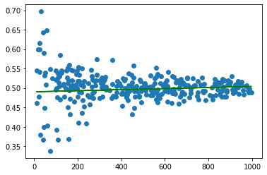
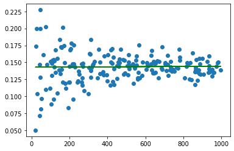

### Fair Coin Probability

- Probability of Fair Coin generated by linear regression is 0.50125506
- Calculated probability of Fair coin is 0.5 (1/2)
- There are 0.25 % error between experimental and actual

### 6-Sided Die Probability

- Predicted Probability for 6-sided Dice is 0.14942494
- Actual Probability is 0.1666 (1/6)
- There are 10.345% error rate between experimental and actual
