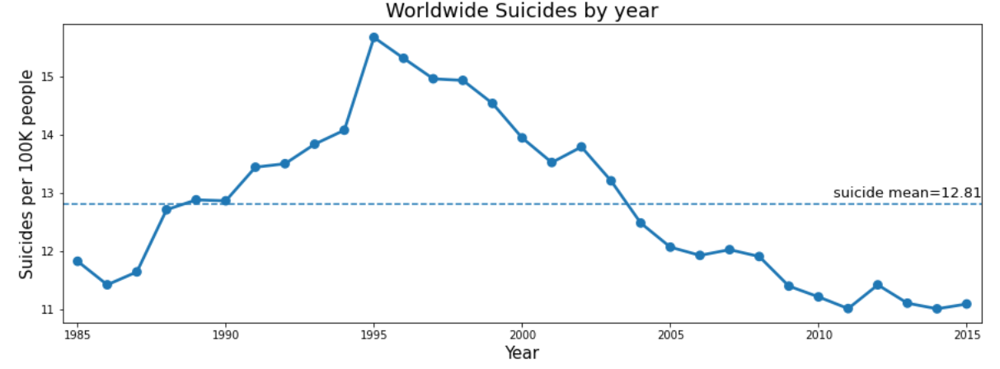
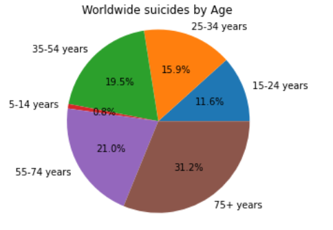
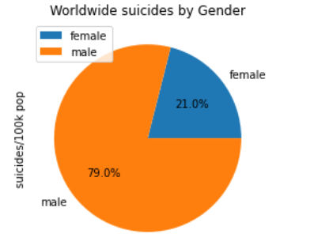
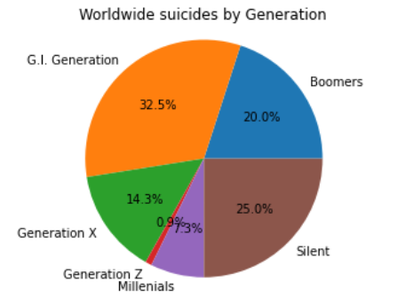

## <a href="https://www.kaggle.com/dongjun819/suicide-data-1985-2016"> Suicide Rates Overview 1985 to 2016 </a>
Compares socio-economic info with suicide rates by year and country

Data Scource for this code is from <a href="https://www.kaggle.com/russellyates88/suicide-rates-overview-1985-to-2016"> kaggle 

## Worldwide suicide by year, age, gender, generation 
 
  
 

 

 
