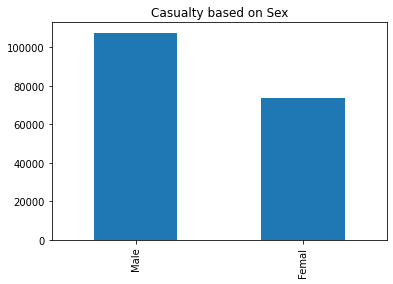
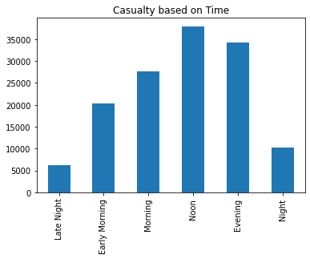
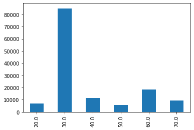

## UK 2016 Road Safety Data
Data from the UK Department for Transport

Data Scource for this code is from <a href="https://www.kaggle.com/bluehorseshoe/uk-2016-road-safety-data/data"> kaggle 

## Based on Analyzing Data, 

### Accident Based on Age

Age 26-35 have most accident throughout all ages

### Accident Based on Sex

Male have more accident than female.

### Accident Based on Home Area

Mostly, Accident happens in Urban area

### Accident Based on Time

Noon is when the accident happens most. Evening is second most.

### Accident Based on Week

Friday is when the accident happens most. Sunday is the least.

### Accident Based on Road Surface Condition

When the road surface is dry, the accident happens most.

### Accident Based on Speed Limit

Accident happens most in 30 speed limit

### Accident Based on Car Model

People who owns FORD vehicle, it has most accidents.

### Accident Based on UK Maps

Accident most likely happens in southern UK

