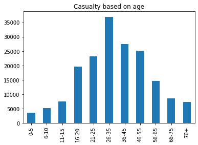
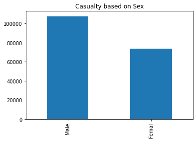
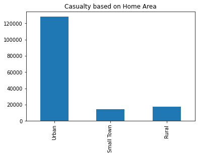
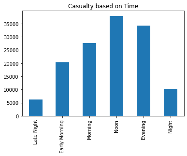
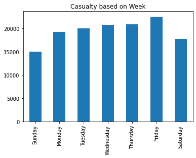
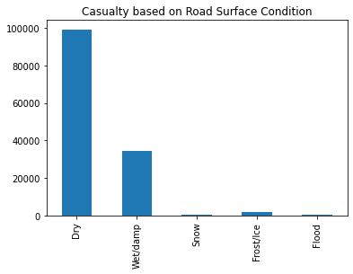
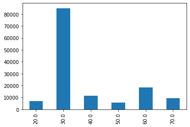
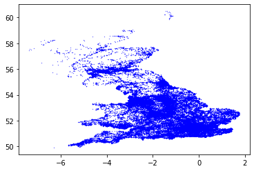
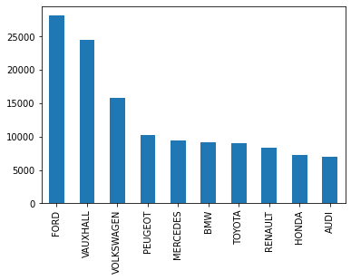

```python
import pandas as pd
import numpy as np
import matplotlib.pyplot as plt
import seaborn as sns
from datetime import datetime
import matplotlib.pyplot as plt
from matplotlib import pylab
import warnings
warnings.filterwarnings('ignore')
```

    In /home/dongjun819/.local/lib/python3.6/site-packages/matplotlib/mpl-data/stylelib/_classic_test.mplstyle: 
    The text.latex.preview rcparam was deprecated in Matplotlib 3.3 and will be removed two minor releases later.
    In /home/dongjun819/.local/lib/python3.6/site-packages/matplotlib/mpl-data/stylelib/_classic_test.mplstyle: 
    The mathtext.fallback_to_cm rcparam was deprecated in Matplotlib 3.3 and will be removed two minor releases later.
    In /home/dongjun819/.local/lib/python3.6/site-packages/matplotlib/mpl-data/stylelib/_classic_test.mplstyle: Support for setting the 'mathtext.fallback_to_cm' rcParam is deprecated since 3.3 and will be removed two minor releases later; use 'mathtext.fallback : 'cm' instead.
    In /home/dongjun819/.local/lib/python3.6/site-packages/matplotlib/mpl-data/stylelib/_classic_test.mplstyle: 
    The validate_bool_maybe_none function was deprecated in Matplotlib 3.3 and will be removed two minor releases later.
    In /home/dongjun819/.local/lib/python3.6/site-packages/matplotlib/mpl-data/stylelib/_classic_test.mplstyle: 
    The savefig.jpeg_quality rcparam was deprecated in Matplotlib 3.3 and will be removed two minor releases later.
    In /home/dongjun819/.local/lib/python3.6/site-packages/matplotlib/mpl-data/stylelib/_classic_test.mplstyle: 
    The keymap.all_axes rcparam was deprecated in Matplotlib 3.3 and will be removed two minor releases later.
    In /home/dongjun819/.local/lib/python3.6/site-packages/matplotlib/mpl-data/stylelib/_classic_test.mplstyle: 
    The animation.avconv_path rcparam was deprecated in Matplotlib 3.3 and will be removed two minor releases later.
    In /home/dongjun819/.local/lib/python3.6/site-packages/matplotlib/mpl-data/stylelib/_classic_test.mplstyle: 
    The animation.avconv_args rcparam was deprecated in Matplotlib 3.3 and will be removed two minor releases later.


```python
cas_data= pd.read_csv('cas.csv')
dff_road_safety_data=pd.read_csv('dftRoadSafety_Accidents_2016.csv')
model_2016_data=pd.read_csv('MakeModel2016.csv')
vehicle_data=pd.read_csv('Veh.csv')
```


```python
cas_data.columns
```


    Index(['Accident_Index', 'Vehicle_Reference', 'Casualty_Reference',
           'Casualty_Class', 'Sex_of_Casualty', 'Age_of_Casualty',
           'Age_Band_of_Casualty', 'Casualty_Severity', 'Pedestrian_Location',
           'Pedestrian_Movement', 'Car_Passenger', 'Bus_or_Coach_Passenger',
           'Pedestrian_Road_Maintenance_Worker', 'Casualty_Type',
           'Casualty_Home_Area_Type', 'Casualty_IMD_Decile'],
          dtype='object')


```python
cas_data.head()
```


<div>
<style scoped>
    .dataframe tbody tr th:only-of-type {
        vertical-align: middle;
    }

    .dataframe tbody tr th {
        vertical-align: top;
    }

    .dataframe thead th {
        text-align: right;
    }
</style>
<table border="1" class="dataframe">
  <thead>
    <tr style="text-align: right;">
      <th></th>
      <th>Accident_Index</th>
      <th>Vehicle_Reference</th>
      <th>Casualty_Reference</th>
      <th>Casualty_Class</th>
      <th>Sex_of_Casualty</th>
      <th>Age_of_Casualty</th>
      <th>Age_Band_of_Casualty</th>
      <th>Casualty_Severity</th>
      <th>Pedestrian_Location</th>
      <th>Pedestrian_Movement</th>
      <th>Car_Passenger</th>
      <th>Bus_or_Coach_Passenger</th>
      <th>Pedestrian_Road_Maintenance_Worker</th>
      <th>Casualty_Type</th>
      <th>Casualty_Home_Area_Type</th>
      <th>Casualty_IMD_Decile</th>
    </tr>
  </thead>
  <tbody>
    <tr>
      <th>0</th>
      <td>2016010000005</td>
      <td>2</td>
      <td>1</td>
      <td>1</td>
      <td>1</td>
      <td>23</td>
      <td>5</td>
      <td>3</td>
      <td>0</td>
      <td>0</td>
      <td>0</td>
      <td>0</td>
      <td>0</td>
      <td>2</td>
      <td>1</td>
      <td>4</td>
    </tr>
    <tr>
      <th>1</th>
      <td>2016010000006</td>
      <td>1</td>
      <td>1</td>
      <td>1</td>
      <td>2</td>
      <td>36</td>
      <td>7</td>
      <td>3</td>
      <td>0</td>
      <td>0</td>
      <td>0</td>
      <td>0</td>
      <td>0</td>
      <td>9</td>
      <td>1</td>
      <td>10</td>
    </tr>
    <tr>
      <th>2</th>
      <td>2016010000008</td>
      <td>1</td>
      <td>1</td>
      <td>1</td>
      <td>1</td>
      <td>24</td>
      <td>5</td>
      <td>3</td>
      <td>0</td>
      <td>0</td>
      <td>0</td>
      <td>0</td>
      <td>0</td>
      <td>9</td>
      <td>1</td>
      <td>8</td>
    </tr>
    <tr>
      <th>3</th>
      <td>2016010000016</td>
      <td>1</td>
      <td>1</td>
      <td>2</td>
      <td>2</td>
      <td>59</td>
      <td>9</td>
      <td>3</td>
      <td>0</td>
      <td>0</td>
      <td>0</td>
      <td>3</td>
      <td>0</td>
      <td>11</td>
      <td>1</td>
      <td>4</td>
    </tr>
    <tr>
      <th>4</th>
      <td>2016010000018</td>
      <td>2</td>
      <td>1</td>
      <td>1</td>
      <td>1</td>
      <td>28</td>
      <td>6</td>
      <td>3</td>
      <td>0</td>
      <td>0</td>
      <td>0</td>
      <td>0</td>
      <td>0</td>
      <td>1</td>
      <td>1</td>
      <td>6</td>
    </tr>
  </tbody>
</table>
</div>


```python
age_range={1:'0-5', 2:'6-10',3:'11-15',4:'16-20',5:'21-25',6:'26-35',7:'36-45',8:'46-55',9:'56-65',10:'66-75',11:'76+'}
cas_data['Age_Band_of_Casualty'].value_counts().sort_index()[1:12].rename(index=age_range).plot(kind='bar')
plt.title('Casualty based on age')
```


    Text(0.5, 1.0, 'Casualty based on age')


    

    


```python
sex_type={1:'Male', 2:'Femal'}
cas_data['Sex_of_Casualty'].value_counts()[:2].rename(index=sex_type).plot(kind='bar')
plt.title('Casualty based on Sex')
```


    Text(0.5, 1.0, 'Casualty based on Sex')


    

    


```python
home_area={1:'Urban', 2:'Small Town', 3:'Rural'}
cas_data['Casualty_Home_Area_Type'].value_counts().sort_index()[1:4].rename(index=home_area).plot(kind='bar')
plt.title('Casualty based on Home Area')
```


    Text(0.5, 1.0, 'Casualty based on Home Area')


    

    


```python
dff_road_safety_data.head()
```


<div>
<style scoped>
    .dataframe tbody tr th:only-of-type {
        vertical-align: middle;
    }

    .dataframe tbody tr th {
        vertical-align: top;
    }

    .dataframe thead th {
        text-align: right;
    }
</style>
<table border="1" class="dataframe">
  <thead>
    <tr style="text-align: right;">
      <th></th>
      <th>Accident_Index</th>
      <th>Location_Easting_OSGR</th>
      <th>Location_Northing_OSGR</th>
      <th>Longitude</th>
      <th>Latitude</th>
      <th>Police_Force</th>
      <th>Accident_Severity</th>
      <th>Number_of_Vehicles</th>
      <th>Number_of_Casualties</th>
      <th>Date</th>
      <th>...</th>
      <th>Pedestrian_Crossing-Human_Control</th>
      <th>Pedestrian_Crossing-Physical_Facilities</th>
      <th>Light_Conditions</th>
      <th>Weather_Conditions</th>
      <th>Road_Surface_Conditions</th>
      <th>Special_Conditions_at_Site</th>
      <th>Carriageway_Hazards</th>
      <th>Urban_or_Rural_Area</th>
      <th>Did_Police_Officer_Attend_Scene_of_Accident</th>
      <th>LSOA_of_Accident_Location</th>
    </tr>
  </thead>
  <tbody>
    <tr>
      <th>0</th>
      <td>2016010000005</td>
      <td>519310.0</td>
      <td>188730.0</td>
      <td>-0.279323</td>
      <td>51.584754</td>
      <td>1</td>
      <td>3</td>
      <td>2</td>
      <td>1</td>
      <td>01/11/2016</td>
      <td>...</td>
      <td>0</td>
      <td>0</td>
      <td>5</td>
      <td>1</td>
      <td>1</td>
      <td>0</td>
      <td>0</td>
      <td>1</td>
      <td>1</td>
      <td>E01000543</td>
    </tr>
    <tr>
      <th>1</th>
      <td>2016010000006</td>
      <td>551920.0</td>
      <td>174560.0</td>
      <td>0.184928</td>
      <td>51.449595</td>
      <td>1</td>
      <td>3</td>
      <td>1</td>
      <td>1</td>
      <td>01/11/2016</td>
      <td>...</td>
      <td>0</td>
      <td>0</td>
      <td>4</td>
      <td>1</td>
      <td>1</td>
      <td>0</td>
      <td>0</td>
      <td>1</td>
      <td>1</td>
      <td>E01000375</td>
    </tr>
    <tr>
      <th>2</th>
      <td>2016010000008</td>
      <td>505930.0</td>
      <td>183850.0</td>
      <td>-0.473837</td>
      <td>51.543563</td>
      <td>1</td>
      <td>3</td>
      <td>1</td>
      <td>1</td>
      <td>01/11/2016</td>
      <td>...</td>
      <td>0</td>
      <td>0</td>
      <td>4</td>
      <td>1</td>
      <td>1</td>
      <td>0</td>
      <td>0</td>
      <td>1</td>
      <td>1</td>
      <td>E01033725</td>
    </tr>
    <tr>
      <th>3</th>
      <td>2016010000016</td>
      <td>527770.0</td>
      <td>168930.0</td>
      <td>-0.164442</td>
      <td>51.404958</td>
      <td>1</td>
      <td>3</td>
      <td>1</td>
      <td>1</td>
      <td>01/11/2016</td>
      <td>...</td>
      <td>0</td>
      <td>0</td>
      <td>1</td>
      <td>1</td>
      <td>1</td>
      <td>0</td>
      <td>0</td>
      <td>1</td>
      <td>1</td>
      <td>E01003379</td>
    </tr>
    <tr>
      <th>4</th>
      <td>2016010000018</td>
      <td>510740.0</td>
      <td>177230.0</td>
      <td>-0.406580</td>
      <td>51.483139</td>
      <td>1</td>
      <td>3</td>
      <td>2</td>
      <td>1</td>
      <td>01/11/2016</td>
      <td>...</td>
      <td>0</td>
      <td>0</td>
      <td>1</td>
      <td>1</td>
      <td>1</td>
      <td>0</td>
      <td>0</td>
      <td>1</td>
      <td>1</td>
      <td>E01002583</td>
    </tr>
  </tbody>
</table>
<p>5 rows × 32 columns</p>
</div>


```python
dff_road_safety_data.columns
```


    Index(['Accident_Index', 'Location_Easting_OSGR', 'Location_Northing_OSGR',
           'Longitude', 'Latitude', 'Police_Force', 'Accident_Severity',
           'Number_of_Vehicles', 'Number_of_Casualties', 'Date', 'Day_of_Week',
           'Time', 'Local_Authority_(District)', 'Local_Authority_(Highway)',
           '1st_Road_Class', '1st_Road_Number', 'Road_Type', 'Speed_limit',
           'Junction_Detail', 'Junction_Control', '2nd_Road_Class',
           '2nd_Road_Number', 'Pedestrian_Crossing-Human_Control',
           'Pedestrian_Crossing-Physical_Facilities', 'Light_Conditions',
           'Weather_Conditions', 'Road_Surface_Conditions',
           'Special_Conditions_at_Site', 'Carriageway_Hazards',
           'Urban_or_Rural_Area', 'Did_Police_Officer_Attend_Scene_of_Accident',
           'LSOA_of_Accident_Location'],
          dtype='object')


```python
dff_road_safety_data['Time'].isnull().sum()
```


    2


```python
dff_road_safety_data.fillna(method='ffill', inplace=True)
```


```python
dff_road_safety_data['Time'].isnull().sum()
```


    0


```python
def hour_from_time(time):
    hhmm = datetime.strptime(time, '%H:%M')
    return int(datetime.strftime(hhmm, '%H'))
```


```python
dff_road_safety_data['Hour']=dff_road_safety_data['Time'].apply(hour_from_time)
```


```python
times = [0,4,8,12,16,20,24]
time_range = ['Late Night', 'Early Morning','Morning','Noon','Evening','Night']
dff_road_safety_data['Hour'] = pd.cut(dff_road_safety_data['Hour'], bins=times, labels=time_range, include_lowest=True)
dff_road_safety_data['Hour']
```


    0            Late Night
    1            Late Night
    2            Late Night
    3               Morning
    4         Early Morning
                  ...      
    136616    Early Morning
    136617             Noon
    136618    Early Morning
    136619          Evening
    136620          Morning
    Name: Hour, Length: 136621, dtype: category
    Categories (6, object): ['Late Night' < 'Early Morning' < 'Morning' < 'Noon' < 'Evening' < 'Night']


```python
dff_road_safety_data['Hour'].value_counts().sort_index()[:6].plot(kind='bar')
plt.title('Casualty based on Time')
```


    Text(0.5, 1.0, 'Casualty based on Time')


    

    


```python
week_range={1:'Sunday', 2:'Monday',3:'Tuesday',4:'Wednesday',5:'Thursday',6:'Friday',7:'Saturday'}
dff_road_safety_data['Day_of_Week'].value_counts().sort_index()[:7].rename(index=week_range).plot(kind='bar')
plt.title('Casualty based on Week')
```


    Text(0.5, 1.0, 'Casualty based on Week')


    

    


```python
set(dff_road_safety_data['Road_Surface_Conditions'])
```


    {-1, 1, 2, 3, 4, 5}


```python
road_condition={1:'Dry', 2:'Wet/damp',3:'Snow',4:'Frost/Ice',5:'Flood',6:'Oil',7:'Mud'}
dff_road_safety_data['Road_Surface_Conditions'].value_counts().sort_index()[1:7].rename(index=road_condition).plot(kind='bar')
plt.title('Casualty based on Road Surface Condition')
```


    Text(0.5, 1.0, 'Casualty based on Road Surface Condition')


    

    


```python
dff_road_safety_data['Speed_limit'].value_counts().sort_index().plot(kind='bar')
```


    <AxesSubplot:>


    

    


```python
plt.plot(dff_road_safety_data['Longitude'], dff_road_safety_data['Latitude'],'b.', ms=0.5)
```


    [<matplotlib.lines.Line2D at 0x7f384c7f5cc0>]


    

    


```python
model_2016_data.head()
```


<div>
<style scoped>
    .dataframe tbody tr th:only-of-type {
        vertical-align: middle;
    }

    .dataframe tbody tr th {
        vertical-align: top;
    }

    .dataframe thead th {
        text-align: right;
    }
</style>
<table border="1" class="dataframe">
  <thead>
    <tr style="text-align: right;">
      <th></th>
      <th>Accident_Index</th>
      <th>accyr</th>
      <th>Vehicle_Reference</th>
      <th>Vehicle_Type</th>
      <th>Towing_and_Articulation</th>
      <th>Vehicle_Manoeuvre</th>
      <th>Vehicle_Location-Restricted_Lane</th>
      <th>Junction_Location</th>
      <th>Skidding_and_Overturning</th>
      <th>Hit_Object_in_Carriageway</th>
      <th>...</th>
      <th>Journey_Purpose_of_Driver</th>
      <th>Sex_of_Driver</th>
      <th>Age_Band_of_Driver</th>
      <th>Engine_Capacity_(CC)</th>
      <th>Propulsion_Code</th>
      <th>Age_of_Vehicle</th>
      <th>Driver_IMD_Decile</th>
      <th>Driver_Home_Area_Type</th>
      <th>make</th>
      <th>model</th>
    </tr>
  </thead>
  <tbody>
    <tr>
      <th>0</th>
      <td>2016010000005</td>
      <td>2016</td>
      <td>1</td>
      <td>8</td>
      <td>0</td>
      <td>6</td>
      <td>0</td>
      <td>0</td>
      <td>0</td>
      <td>0</td>
      <td>...</td>
      <td>1</td>
      <td>1</td>
      <td>8</td>
      <td>-1</td>
      <td>-1</td>
      <td>-1</td>
      <td>3</td>
      <td>1</td>
      <td>NaN</td>
      <td>NaN</td>
    </tr>
    <tr>
      <th>1</th>
      <td>2016010000005</td>
      <td>2016</td>
      <td>2</td>
      <td>2</td>
      <td>0</td>
      <td>18</td>
      <td>0</td>
      <td>0</td>
      <td>0</td>
      <td>0</td>
      <td>...</td>
      <td>6</td>
      <td>1</td>
      <td>5</td>
      <td>124</td>
      <td>1</td>
      <td>4</td>
      <td>4</td>
      <td>1</td>
      <td>YAMAHA</td>
      <td>HW 125 XENTER</td>
    </tr>
    <tr>
      <th>2</th>
      <td>2016010000006</td>
      <td>2016</td>
      <td>1</td>
      <td>9</td>
      <td>0</td>
      <td>18</td>
      <td>0</td>
      <td>2</td>
      <td>2</td>
      <td>10</td>
      <td>...</td>
      <td>6</td>
      <td>2</td>
      <td>7</td>
      <td>1461</td>
      <td>2</td>
      <td>1</td>
      <td>10</td>
      <td>1</td>
      <td>MERCEDES</td>
      <td>A180 BLUEEFFICIENCY SPORT CDI</td>
    </tr>
    <tr>
      <th>3</th>
      <td>2016010000008</td>
      <td>2016</td>
      <td>1</td>
      <td>9</td>
      <td>0</td>
      <td>18</td>
      <td>0</td>
      <td>4</td>
      <td>5</td>
      <td>0</td>
      <td>...</td>
      <td>6</td>
      <td>1</td>
      <td>5</td>
      <td>1390</td>
      <td>1</td>
      <td>5</td>
      <td>8</td>
      <td>1</td>
      <td>VOLKSWAGEN</td>
      <td>SCIROCCO TSI</td>
    </tr>
    <tr>
      <th>4</th>
      <td>2016010000016</td>
      <td>2016</td>
      <td>1</td>
      <td>11</td>
      <td>0</td>
      <td>18</td>
      <td>0</td>
      <td>1</td>
      <td>0</td>
      <td>0</td>
      <td>...</td>
      <td>1</td>
      <td>1</td>
      <td>8</td>
      <td>6692</td>
      <td>2</td>
      <td>7</td>
      <td>9</td>
      <td>1</td>
      <td>OTHER BRITISH</td>
      <td>Missing</td>
    </tr>
  </tbody>
</table>
<p>5 rows × 24 columns</p>
</div>


```python
model_2016_data.columns
```


    Index(['Accident_Index', 'accyr', 'Vehicle_Reference', 'Vehicle_Type',
           'Towing_and_Articulation', 'Vehicle_Manoeuvre',
           'Vehicle_Location-Restricted_Lane', 'Junction_Location',
           'Skidding_and_Overturning', 'Hit_Object_in_Carriageway',
           'Vehicle_Leaving_Carriageway', 'Hit_Object_off_Carriageway',
           '1st_Point_of_Impact', 'Was_Vehicle_Left_Hand_Drive',
           'Journey_Purpose_of_Driver', 'Sex_of_Driver', 'Age_Band_of_Driver',
           'Engine_Capacity_(CC)', 'Propulsion_Code', 'Age_of_Vehicle',
           'Driver_IMD_Decile', 'Driver_Home_Area_Type', 'make', 'model'],
          dtype='object')


```python
car_model = model_2016_data[['make','model']]
car_model.dropna()
```


<div>
<style scoped>
    .dataframe tbody tr th:only-of-type {
        vertical-align: middle;
    }

    .dataframe tbody tr th {
        vertical-align: top;
    }

    .dataframe thead th {
        text-align: right;
    }
</style>
<table border="1" class="dataframe">
  <thead>
    <tr style="text-align: right;">
      <th></th>
      <th>make</th>
      <th>model</th>
    </tr>
  </thead>
  <tbody>
    <tr>
      <th>1</th>
      <td>YAMAHA</td>
      <td>HW 125 XENTER</td>
    </tr>
    <tr>
      <th>2</th>
      <td>MERCEDES</td>
      <td>A180 BLUEEFFICIENCY SPORT CDI</td>
    </tr>
    <tr>
      <th>3</th>
      <td>VOLKSWAGEN</td>
      <td>SCIROCCO TSI</td>
    </tr>
    <tr>
      <th>4</th>
      <td>OTHER BRITISH</td>
      <td>Missing</td>
    </tr>
    <tr>
      <th>5</th>
      <td>BMW</td>
      <td>116i</td>
    </tr>
    <tr>
      <th>...</th>
      <td>...</td>
      <td>...</td>
    </tr>
    <tr>
      <th>252494</th>
      <td>RENAULT</td>
      <td>MEGANE DYNAMIQUE 16V</td>
    </tr>
    <tr>
      <th>252495</th>
      <td>MINI</td>
      <td>MINI COOPER</td>
    </tr>
    <tr>
      <th>252496</th>
      <td>VAUXHALL</td>
      <td>ASTRA ENERGY CDTI</td>
    </tr>
    <tr>
      <th>252498</th>
      <td>VAUXHALL</td>
      <td>VECTRA SXI 16V</td>
    </tr>
    <tr>
      <th>252499</th>
      <td>MAZDA</td>
      <td>CX-7 SPORT TECH D</td>
    </tr>
  </tbody>
</table>
<p>204775 rows × 2 columns</p>
</div>


```python
car_model['make'].value_counts()[:10].plot(kind='bar')
```


    <AxesSubplot:>


    

    

