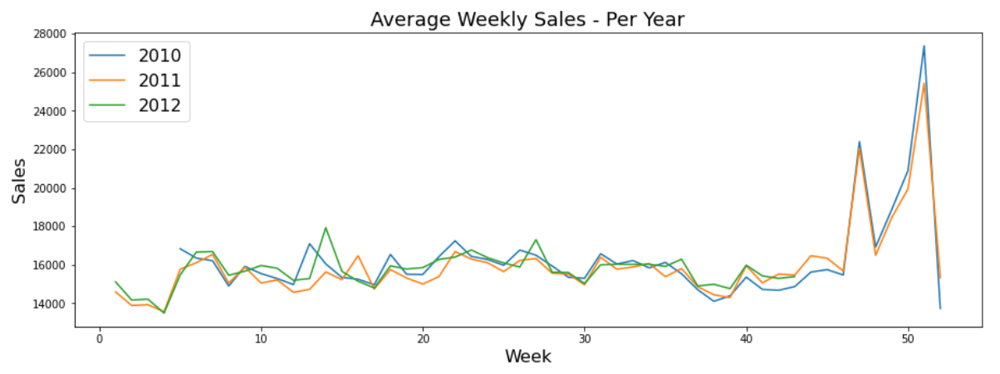

## <a href="https://www.kaggle.com/dongjun819/walmart-store-sales-forecasting"> Walmart Recruiting - Store Sales Forecasting</a>
Use historical markdown data to predict store sales

Data Scource for this code is from <a href="https://www.kaggle.com/c/walmart-recruiting-store-sales-forecasting/data"> kaggle 

### Summary
- Walmart's Sale price increase dramatically starts from November to December. However, Sale Price decrease dramatically end of the December. 
- Customer comes to Walmart often during high temperatures. 
- Walmart's unemployment rate decreases over the year.
