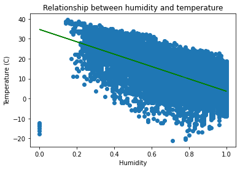
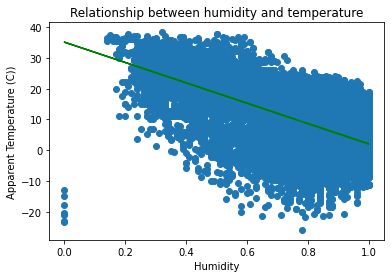

# Weather in Szeged 2006-2016

Data Scource for this code is from <a href="https://www.kaggle.com/budincsevity/szeged-weather"> kaggle Weather in Szeged 2006-2016

## Humidity vs. Temperature vs. Apparent Temperature

### Humidity vs. Temperature

- Mean Absolute Error (MAE) : 6.036725541877051
- Mean Squared Error (MSE) : 54.85106778224978
- Root Mean Squared Error (RMSE) : 7.406150672397219
- R2 Square 0.4010174773031755

Relationship between humidity and temperature

RMSE score is 7.406150672397219 which means Linear Regression predicts by 7.40 C° accuracy 

### Humidity vs. Apparent Temperature

- Mean Absolute Error (MAE) : 6.963821565758622
- Mean Squared Error (MSE) : 72.9872531161357
- Root Mean Squared Error (RMSE) : 8.543257757795658
- R2 Square 0.364487438377763

Relationship between humidity and Apparent temperature

RMSE score is 8.543257757795658 which means Linear Regression predicts by 8.54 C° accuracy 
