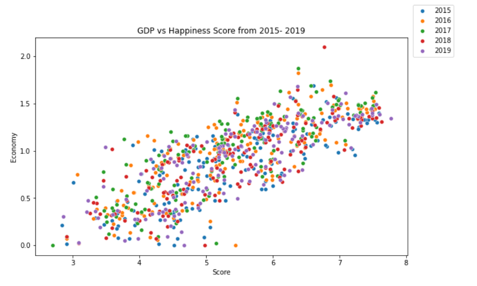
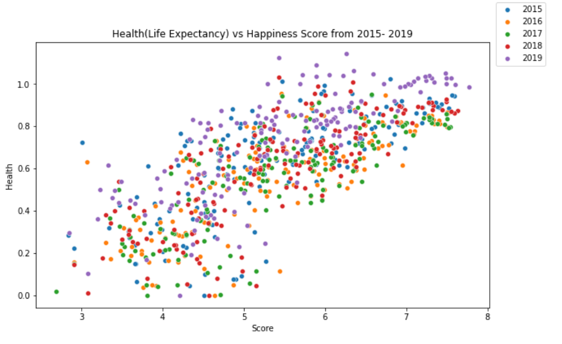
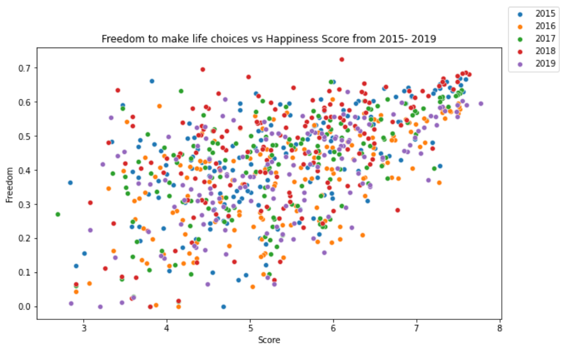
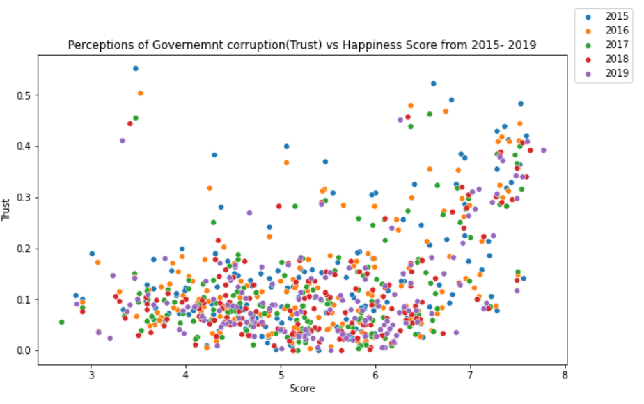

## World Happiness Report
Happiness scored according to economic production, social support, etc.

Data Scource for this code is from <a href="https://www.kaggle.com/unsdsn/world-happiness"> kaggle

### From 2015-2019
- In 2015, Happiest Country is Switzerland and Saddest Country is Togo
- In 2016, Happiest Country is Denmark and Saddest Country is Burundi
- In 2017, Happiest Country is Norway and Saddest Country is Central African Republic
- In 2018, Happiest Country is Finland and Saddest Country is Burundi
- In 2019, Happiest Country is Finland and Saddest Country is South Sudan

Higher GDP, Healthier, More Freedom, Lower the Government corruption leads to Happier country.

### GDP vs. Happiness

### Health(Life Expectancy) vs. Happiness

### Freedom to make life choices vs. Happiness

### Perceptions of Governemnt corruption(Trust) vs Happiness

