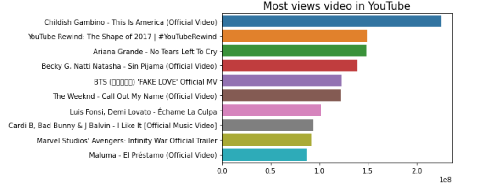
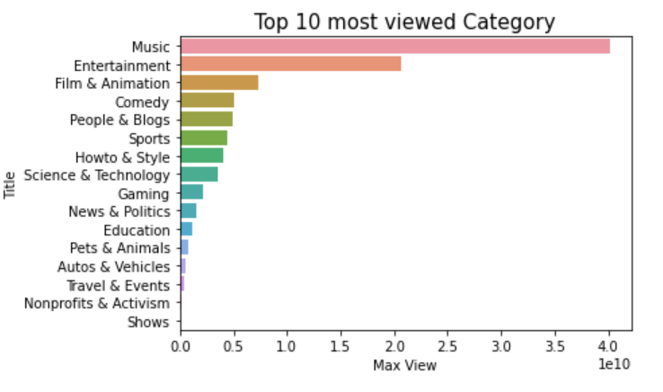
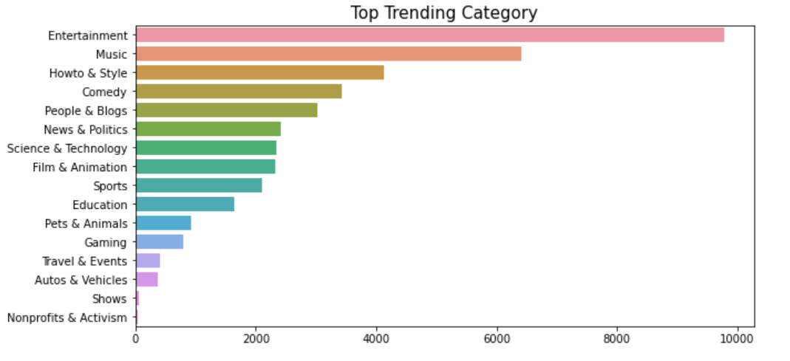
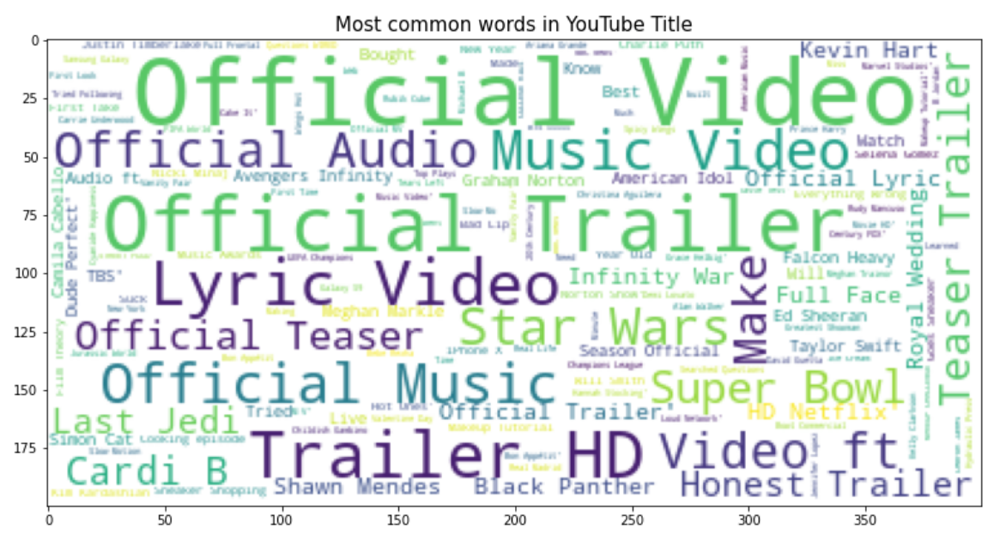

## <a href="https://www.kaggle.com/dongjun819/youtube-trending-analysis">Trending YouTube Video Statistics</a>
Daily statistics for trending YouTube videos

Data Scource for this code is from <a href="https://www.kaggle.com/datasnaek/youtube-new"> kaggle </a>

### Most Viewed Video in YouTube

### Most Viewed Category in YouTube

### Top Trending Category in YouTube

### Most Common Word for YouTube Title

